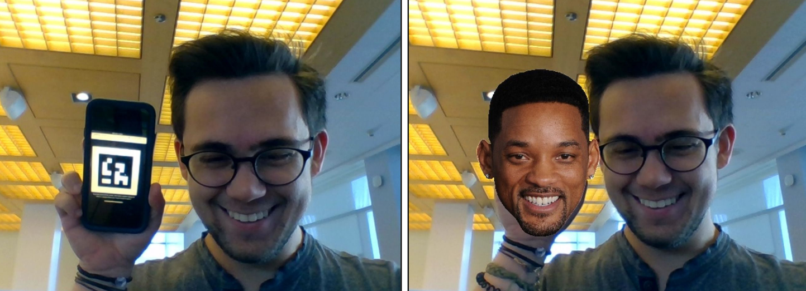

# Oncrop

Oncrop is a web app that will crop a missing's friend face into the photo in real time. You place the photo by moving your phone around in the frame; the camera will track your phone using a provided ARUCO code. Don't worry, the web app is user friendly and will walk you through the steps.



## Installation
Oncrop requires several dependencies to run. To make lives easier, dependency installation and configuration is all handled automatically by `setup.py`. Simply open a shell and run the following commands:

```sh
	$ python setup.py
```
Note: Oncrop makes use of OpenCV's aruco detection capabilities, which seems to require opencv-contrib-python instead of just opencv-python. Even if you already have OpenCV installed, the setup script will download the opencv-contrib-python package.

## Use
After running the setup file above, `cd` into the `./source` directory and run:

```sh
	$ python app.py
```

When the application server starts, follow the link output to the terminal. It should look something like this:

```sh
	$ * Running on http://127.0.0.1:8080/ (Press CTRL+C to quit)
```

The web app contains all of the instructions from there on out.

> _&copy; 2019 Elias Gabriel, Duncan Mazza_	
